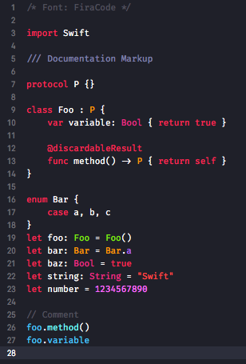

# Xcode 8 color theme

<p align="center"></p>

Copy `CUSTOME.xccolortheme` file to following path:

```
/Users/MY_USER_NAME/Library/Developer/Xcode/UserData/FontAndColorThemes/
```

Font: [FiraCode](https://github.com/tonsky/FiraCode/releases)
